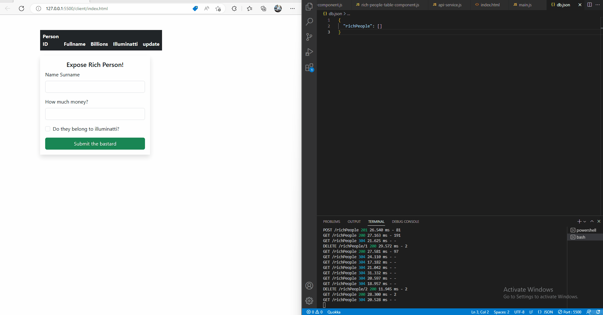

# FullStack CRUD App by Aivaras Rozukas


Application files are in folders 
```
Client
```
and
```
Server
```

explanation in-depth about application and principles of executed functionality are available at __readme.md__ in <b>server</b> folder


# Example of running applicaiton:




</br>
</br>
</br>


Thank you for having an interest in this Project.